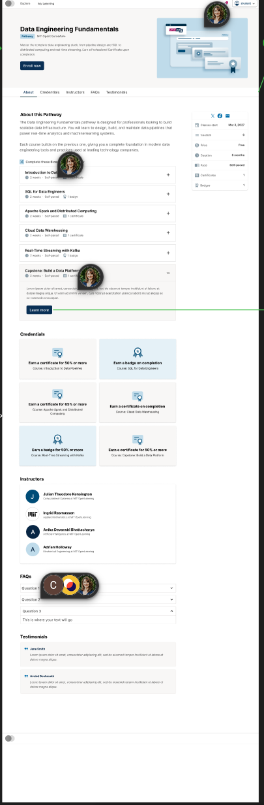
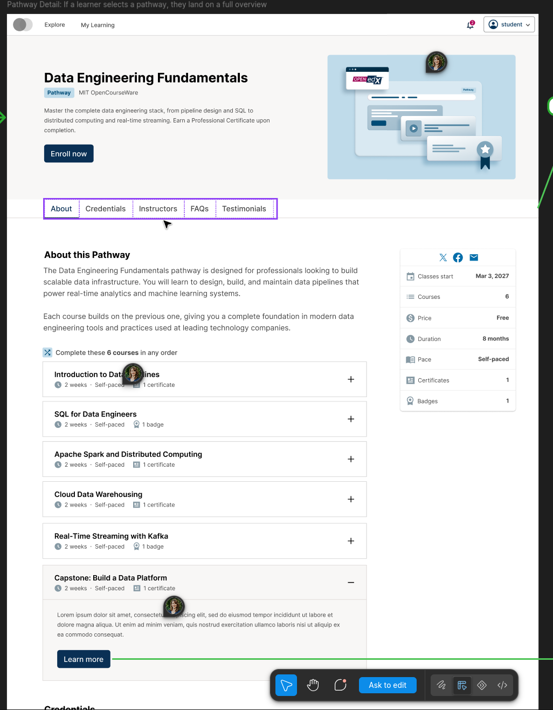
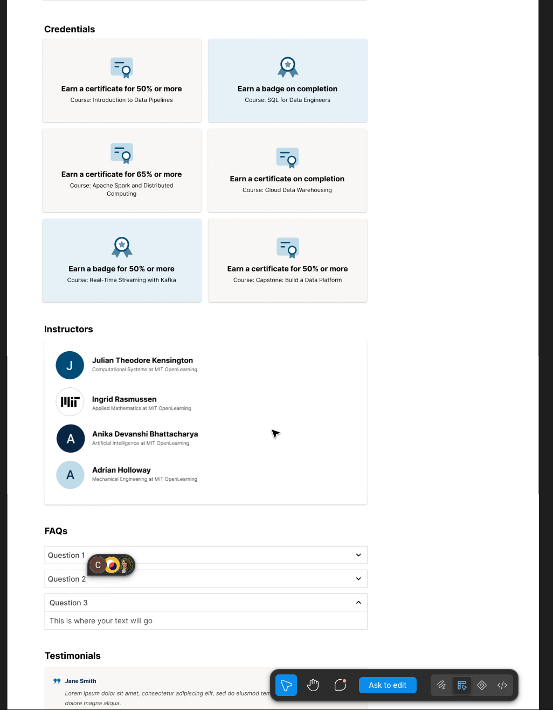
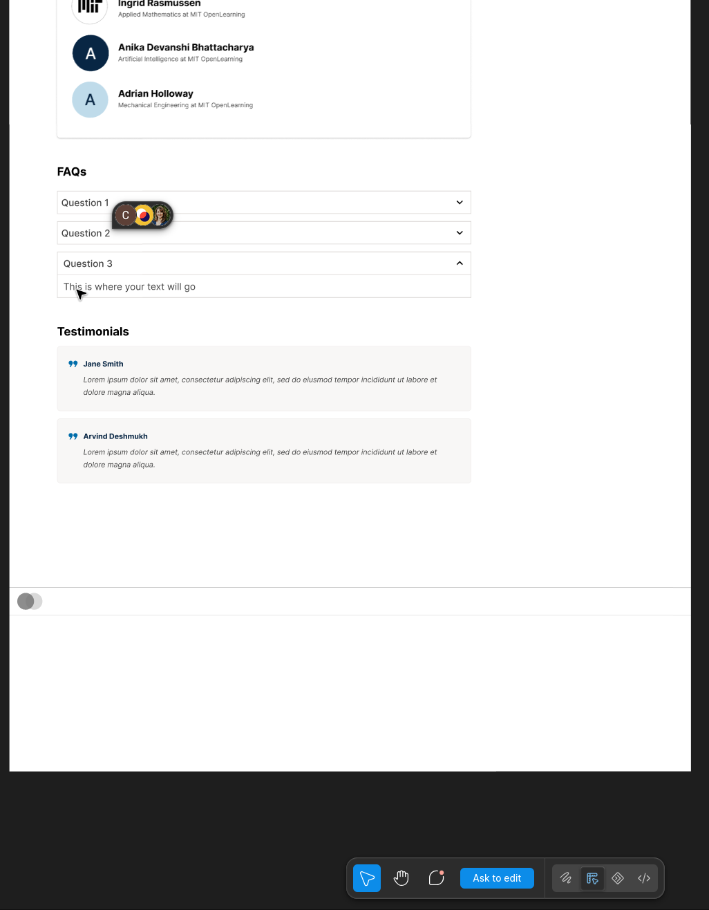

FAL-4380: Pathway Detail Page Implementation Plan
=================================================

Status
------

Draft implementation plan. This change is frontend-only and uses static typed fixture data.

Goal
----

Add an always-available pathway detail page at ``/pathways/:pathwayId`` while preserving existing pathway cards and course About behavior.

Design References
-----------------

The approved Figma screenshots below are the visual reference for the pathway detail page. Full-page first, then section crops.

   Full-page view of the approved design.

   Hero, About, and Courses crops.

   Credentials, Instructors, and FAQs crops.

   FAQs and Testimonials crops.

Figma comment bubbles, collaborator avatars, green annotation lines and arrows, cursors, and editor/tool overlays visible in these screenshots are review artifacts only and are **not** implementation requirements.

Confirmed Decisions
-------------------

* The route is available regardless of ``ENABLE_PATHWAY_PILOT_UI``.
* Existing ``PathwayCard`` links remain unchanged.
* Scope is limited to the detail page; search endpoint and feature-flag cleanup are excluded.
* Any nonempty pathway ID renders one typed Data Engineering fixture with the requested ID substituted.
* The fixture defaults to ``isEnrolled: false``.
* The fixture contains:

  * 8 courses.
  * 8 credentials.
  * The first 6 courses and credentials matching the approved screenshots.
  * 4 instructors.
  * 3 FAQs.
  * 2 testimonials.
  * A complete embedded dummy ``CourseAboutData`` for every course.

* The existing ``no-course-image.svg`` fallback is used for the pathway hero.
* About, Credentials, Instructors, FAQs, and Testimonials are vertically stacked sections.
* Course and credential lists initially show 6 items and have independent controls.
* Course accordions are initially collapsed and allow multiple courses to remain open.
* FAQs use the installed Paragon ``Collapsible`` component with basic styling and allow multiple open entries.
* The CTA matrix is:

  * ``isEnrolled === false``: only a disabled “Enroll now” button.
  * ``isEnrolled === true``: only a disabled “View pathway” button.

* No API, persistence, authentication, enrollment mutation, or loading state is required.
* Course “Learn more” opens a large scrollable modal without changing the URL.
* The modal reuses the complete course About body but suppresses enrollment and view-course actions.
* Existing direct course About routes, APIs, plugin slots, and cards remain functional.

Data and Component Shape
------------------------

Pathway Detail Types
~~~~~~~~~~~~~~~~~~~~

Add only the concrete types needed by the fixture and page:

.. code-block:: typescript

   interface PathwayDetailData {
     id: string;
     name: string;
     organization: string;
     description: string;
     imageUrl?: string;
     isEnrolled: boolean;
     facts: PathwayFact[];
     courses: PathwayCourse[];
     credentials: PathwayCredential[];
     instructors: PathwayInstructor[];
     faqs: PathwayFaq[];
     testimonials: PathwayTestimonial[];
   }

   interface PathwayCourse {
     id: string;
     title: string;
     summary: string;
     courseAboutData: CourseAboutData;
   }

The remaining item interfaces should contain only fields rendered by their sections. Do not add endpoint response wrappers, repositories, service interfaces, enrollment models, or speculative extension points.

Fixture Lookup
~~~~~~~~~~~~~~

Export one fixture and one small lookup function:

.. code-block:: typescript

   const DATA_ENGINEERING_PATHWAY: PathwayDetailData = { /* fixture */ };

   export const getPathwayDetail = (pathwayId: string) => (
     pathwayId.trim()
       ? { ...DATA_ENGINEERING_PATHWAY, id: pathwayId }
       : undefined
   );

The first six course and credential records must reproduce the approved screenshot content verbatim. The final two entries provide enough data to exercise each “See more” control.

Do not introduce React Query hooks or API modules for static fixture lookup.

Paragon-First UI
----------------

Before writing custom markup or CSS, reuse existing ``CourseAbout`` patterns and the installed Paragon components:

* Use Paragon ``Container``, ``Layout``/``Layout.Element``, ``Nav``/``Nav.Link``, ``Image``, ``Avatar``, ``Badge``, ``Button``, ``Card``, ``Collapsible``, ``Stack``, and ``ModalDialog`` where applicable.
* Prefer Paragon/Bootstrap utility classes for spacing, display, alignment, sizing, typography, and responsive behavior.
* Write custom SCSS only when Paragon components or utilities cannot express the required behavior (for example, the sticky nav offset/scroll margin, exact hero sizing, or modal overflow constraints); do not recreate built-in component visuals.
* Keep semantic HTML for landmarks and content (``header``, ``section``, ``aside``, ``figure``, and similar) where no component improves it.
* Check the installed Paragon API and current repo usage before assuming a component is unavailable.

Reusable Course About Seam
--------------------------

Extract the already-rendered course body from ``CourseAboutPage`` into a reusable ``CourseAboutBody`` component.

``CourseAboutBody`` should own the existing responsive ``Layout``, media, intro, overview, and sidebar composition. It should accept:

.. code-block:: typescript

   interface CourseAboutBodyProps {
     courseAboutData: CourseAboutData;
     hideActions?: boolean;
   }

``CourseAboutPage`` retains its current route lookup, ``useCourseAboutData`` API flow, loading/error handling, ``Head``, and outer ``Container``. After successful loading, it delegates the current layout to ``CourseAboutBody``.

Pass optional ``hideActions`` through ``CourseAboutIntroSlot`` to ``CourseIntro``. Extract a small ``CourseIntroActions`` child inside ``CourseIntro.tsx`` that owns ``getAuthenticatedUser``, ``useEnrollmentActions``, and ``useEnrollmentStatus``, and render it only when ``hideActions`` is false, so hiding actions prevents the enrollment/auth hooks from mounting at all. The default remains false, preserving the direct course About page and plugin behavior.

The pathway modal supplies the selected course's embedded ``CourseAboutData`` and sets ``hideActions``. It must not invoke ``useCourseAboutData``, ``useEnrollment``, or ``changeCourseEnrolment``.

Page Structure
--------------

Hero
~~~~

Render:

* Pathway name as the page ``h1`` and ``Head`` title.
* Organization and summary.
* Hero image resolved with existing ``getFullImageUrl``.
* ``noCourseImg`` from ``src/assets/images/no-course-image.svg`` as the image fallback.
* Exactly one disabled CTA selected from the enrollment matrix.

Use a real ``img`` with meaningful alt text and an image-error fallback, or the existing Paragon image component if it directly supports ``fallbackSrc``.

Section Navigation
~~~~~~~~~~~~~~~~~~

Place a navigation bar after the hero with links in this exact order:

#. About
#. Credentials
#. Instructors
#. FAQs
#. Testimonials

Each link uses a real fragment destination such as ``href="#credentials"``. Each target section has the corresponding stable ``id`` and ``scroll-margin-top``.

Use the installed Paragon ``Nav`` component for the bar (``<Nav as="nav">`` with the same ``aria-label`` and sticky class) and ``Nav.Link`` for each fragment link. The initial step has no active state; the later scrollspy step adds ``aria-current`` and the observer on top of this component.

Use ``position: sticky`` for the navigation with ``top: 0``; no fixed app-header offset exists in this repo's styles, so the nav needs no clearance. Define one CSS custom property for the nav height; the combined section offset is the nav height alone (sticky top is 0). Use that combined offset consistently for both section ``scroll-margin-top`` and the ``IntersectionObserver`` root margin.

Inside ``PathwayDetailPage``, create one ``IntersectionObserver`` for the five section elements. Update the active link as sections enter the offset viewport and use ``history.replaceState`` to synchronize the URL hash without adding a history entry for every scroll event. Clicking a link may use normal browser fragment navigation.

Mark the active link with ``aria-current="location"``. Disconnect the observer on cleanup. Do not add a scrollspy dependency or a reusable hook used by only this page.

About
~~~~~

Render overview content followed by all course accordions.

Each course uses its own Paragon ``Collapsible`` with ``styling="card"``; each instance holds its own open state, so no shared state or Accordion wrapper is needed. All courses start collapsed, and opening one must not close another.

Initially render the first 6 courses. A single About-specific button toggles between all 8 and the first 6, with text and ``aria-expanded`` changing between “See more” and “See less”.

Each expanded course contains a “Learn more” button that selects the course and opens the modal.

Credentials
~~~~~~~~~~~

Initially render the first 6 credentials. Use a separate state value and separate “See more”/“See less” button from the course list. Expanding credentials must not affect course visibility.

Instructors
~~~~~~~~~~~

Render all 4 instructors using semantic headings, with only the name and role/affiliation supplied by the screenshots. Use the Paragon ``Avatar`` component (``size="sm"``) with its default silhouette fallback, since the fixture has no avatar images, and an empty ``alt`` because the instructor name is adjacent and should not be announced twice. No biography text is required.

FAQs
~~~~

Render all 3 FAQs with Paragon ``Collapsible`` components using ``styling="basic"``. Do not add shared open-state logic; each instance's independent state provides multi-open disclosure.

Testimonials
~~~~~~~~~~~~

Render both testimonials with quotation semantics and attribution.

Sidebar
~~~~~~~

Render pathway facts and social sharing alongside the primary section stack at desktop widths. Compose the page with the Paragon ``Layout`` component and two ``Layout.Element`` columns (``xs`` 12/12, ``lg`` 9/3), mirroring ``CourseAboutPage``, and use Bootstrap utility classes for the top margin, column alignment, and the vertical mobile gutter. Under the ``lg`` breakpoint the columns stack naturally, placing the sidebar in normal document flow so the page is fully stacked.

Reuse the ``SocialLinks`` component from ``src/course-about/course-sidebar/sidebar-social``, the same icons it uses imported directly from ``@openedx/paragon/icons``, and the exported ``getFacebookShareUrl``. Construct the pathway Twitter and mailto destinations page-locally in ``PathwayDetailPage.tsx`` using ``encodeURIComponent`` and pathway i18n messages, with ``window.location.href`` as the current pathway URL. Leave the course ``utils.ts`` and its test untouched; no social utils refactor is required.

Add pathway-specific internationalized share text rather than describing the pathway as an enrolled course.

Course Modal
------------

Implement the modal with Paragon ``ModalDialog`` rather than adapting ``VideoModal``, whose fixed video title and transparent styling are unsuitable.

The modal must:

* Use ``size="lg"``.
* Have an accessible title derived from the selected course.
* Contain ``CourseAboutBody`` with the selected embedded ``CourseAboutData``.
* Pass ``hideActions``.
* Have a bounded viewport height with an internally scrollable body.
* Close through the close button, Escape, and standard Paragon dialog behavior.
* Clear selected-course state on close.
* Preserve and restore focus through Paragon.
* Never navigate or modify the URL.
* Become near-full-screen on mobile while retaining a visible close control and scrollable content.

Use one nullable selected-course state; do not create a modal store or URL-backed state.

Implementation Plan
-------------------

Step 1: Foundation
~~~~~~~~~~~~~~~~~~

**Status: Complete**

#. Add ``ROUTES.PATHWAY_DETAIL`` with value ``/pathways/:pathwayId`` in ``src/routes.ts`` and register ``PathwayDetailPage`` in ``src/App.tsx`` before the wildcard route, ungated by configuration.
#. Add the minimal pathway detail types and Data Engineering fixture, with lookup for every nonempty ID without API or React Query.
#. Build ``PathwayDetailPage`` using ``useParams`` and the static lookup function: hero with Paragon ``Image`` and the disabled CTA matrix, all five stacked section targets, and the Paragon ``Layout`` desktop/mobile grid composition (``Layout.Element`` columns: ``xs`` 12/12, ``lg`` 9/3).
#. Implement independently expandable courses with a single About-specific “See more”/“See less” button, credential-only visibility toggling, Paragon ``Collapsible`` course and FAQ disclosures, instructors, testimonials, and facts.
#. Add pathway-specific internationalized copy in a dedicated messages file and import the pathway stylesheet from ``src/index.scss``.
#. Add focused route and page-interaction tests.

Step 2: Navigation and Sidebar
~~~~~~~~~~~~~~~~~~~~~~~~~~~~~~

**Status: Complete**

Already done: Paragon ``Nav`` hash links, sticky CSS, and the Paragon ``Layout`` facts sidebar.

#. Implement the page-local ``IntersectionObserver`` effect that updates the active link as sections enter the offset viewport, marking it with ``aria-current="location"``, and use ``history.replaceState`` to synchronize the URL hash while preserving pathname and query.
#. Use one consistent offset (the nav height alone) for both section ``scroll-margin-top`` and the observer root margin.
#. Add social share links (Facebook, Twitter, email) via the existing ``SocialLinks`` component with pathway-specific i18n share text, plus scrollspy tests.

Step 3: Course About Modal
~~~~~~~~~~~~~~~~~~~~~~~~~~

**Status: Complete**

#. Ensure every fixture course embeds a complete ``CourseAboutData``.
#. Extract ``CourseAboutBody`` from the successful-content branch of ``CourseAboutPage``.
#. Add optional ``hideActions`` plumbing through ``CourseAboutIntroSlot`` and ``CourseIntro``, extracting a small ``CourseIntroActions`` child that owns the enrollment/auth hooks and renders only when ``hideActions`` is false; preserve the current default course behavior.
#. Implement the page-local Paragon ``ModalDialog`` with one nullable selected-course state, ``hideActions``, no URL change, and a bounded viewport height with responsive near-full-screen overflow styling.
#. Add modal and course-regression tests.

Step 4: Verification and Polish
~~~~~~~~~~~~~~~~~~~~~~~~~~~~~~~

**Status: In progress**

#. Review screenshots, responsive behavior, and accessibility.
#. Run only the affected tests, TypeScript checking, ESLint for touched files, and Stylelint for the new stylesheet; no full suite.
#. Verify existing course and pathway card behavior remains unchanged.

Files to Modify
---------------

``src/routes.ts``
  Add ``ROUTES.PATHWAY_DETAIL``.

``src/App.tsx``
  Import and register ``PathwayDetailPage`` without a feature-flag condition.

``src/App.test.tsx``
  Mock or otherwise supply the static pathway fixture and assert that a concrete ``/pathways/some-id`` URL renders the pathway page rather than ``NotFoundPage``.

``src/course-about/CourseAboutPage.tsx``
  Retain data fetching and page-state handling, but delegate its existing successful layout to ``CourseAboutBody``.

``src/course-about/course-intro/CourseIntro.tsx``
  Accept optional ``hideActions``; extract a small ``CourseIntroActions`` child owning the enrollment/auth hooks, rendered only when ``hideActions`` is false (no new file).

``src/plugin-slots/CourseAboutIntroSlot/index.tsx``
  Pass optional ``hideActions`` to the default ``CourseIntro`` and expose it through ``pluginProps``.

``src/course-about/CourseAboutPage.test.tsx``
  Keep existing direct-route coverage and add one assertion that the normal page still renders its enrollment/view action footer.

``src/index.scss``
  Import the pathway detail stylesheet.

New Files
---------

``src/course-about/CourseAboutBody.tsx``
  Reusable responsive course About composition used by both the direct page and pathway modal.

``src/pathway-detail/types.ts``
  Minimal rendered pathway-detail data types.

``src/pathway-detail/data.ts``
  Typed Data Engineering fixture, embedded dummy ``CourseAboutData`` records, and nonempty-ID lookup.

``src/pathway-detail/messages.ts``
  Internationalized pathway labels, controls, CTA text, and share copy.

``src/pathway-detail/PathwayDetailPage.tsx``
  Route page, stacked sections, local expansion state, scrollspy, social sidebar, and course modal.

``src/pathway-detail/PathwayDetailPage.scss``
  Sticky navigation offset, section scroll margins, hero spacing, and mobile modal sizing. The page grid lives in Paragon ``Layout``/Bootstrap utilities, not custom CSS.

``src/pathway-detail/PathwayDetailPage.test.tsx``
  Focused rendering and interaction coverage.

Focused Tests
-------------

Route
~~~~~

* ``/pathways/pathway-1`` renders the Data Engineering pathway page.
* The route works when ``ENABLE_PATHWAY_PILOT_UI`` is false or absent.
* An unrelated route still renders ``NotFoundPage``.
* Existing ``PathwayCard.test.tsx`` continues asserting ``/pathways/pathway-1``; no card test changes are necessary.

Fixture
~~~~~~~

* A nonempty ID is copied into returned fixture data.
* The fixture has 8 courses, 8 credentials, 4 instructors, 3 FAQs, and 2 testimonials.
* ``isEnrolled`` defaults to false.
* Course entries contain complete typed ``CourseAboutData``.

Page and CTA
~~~~~~~~~~~~

* The page renders the hero, fallback image behavior, facts, and all five section headings.
* Unenrolled data renders only disabled “Enroll now”.
* An enrolled fixture override renders only disabled “View pathway”.
* No enrollment API or authentication hook is called.

Progressive Disclosure
~~~~~~~~~~~~~~~~~~~~~~~

* Courses and credentials initially show 6 items.
* Course “See more” reveals 8 courses without changing credentials.
* Credential “See more” reveals 8 credentials without changing courses.
* Each control returns its list to 6 with “See less”.
* Multiple course disclosures and multiple FAQs can remain open.

Navigation and Scrollspy
~~~~~~~~~~~~~~~~~~~~~~~~

* All five navigation links have the expected hashes.
* Active observer entries update ``aria-current`` and call ``history.replaceState`` with the corresponding hash.
* Observer cleanup calls ``disconnect``.
* Mock ``IntersectionObserver`` locally in this test file; do not add a global scrollspy test harness.

Modal
~~~~~

* “Learn more” opens a dialog for the selected course.
* The dialog renders the selected embedded course About content.
* Enrollment and view-course actions are absent inside the modal.
* Opening and closing the modal does not change ``window.location.pathname`` or ``window.location.hash``.
* Closing removes the dialog.
* Mobile-specific behavior is covered through stylesheet rules and one existing ``useMediaQuery``-style rendering assertion if needed; avoid browser-layout simulation in Jest.

Course Regression
~~~~~~~~~~~~~~~~~

* ``CourseAboutPage`` still calls ``useCourseAboutData``.
* Its loading and error states remain unchanged.
* Its normal intro continues rendering actions.
* Existing course cards and ``/courses/:courseId/about`` routing remain unchanged.

Verification Commands
---------------------

Run the focused checks rather than the full suite:

.. code-block:: console

   npm test -- --runInBand src/pathway-detail/PathwayDetailPage.test.tsx src/App.test.tsx src/course-about/CourseAboutPage.test.tsx
   npm run types
   npx eslint src/pathway-detail src/course-about/CourseAboutBody.tsx src/course-about/CourseAboutPage.tsx src/course-about/course-intro/CourseIntro.tsx src/plugin-slots/CourseAboutIntroSlot/index.tsx src/App.tsx src/routes.ts
   npx stylelint "src/pathway-detail/*.scss" --config .stylelintrc.json

Acceptance Criteria
-------------------

* Visiting any ``/pathways/<nonempty-id>`` URL renders the pathway detail page.
* Route availability does not depend on ``ENABLE_PATHWAY_PILOT_UI``.
* Existing pathway cards retain their current detail links.
* The displayed fixture is Data Engineering, uses the URL's ID, and is unenrolled by default.
* Fixture counts are exactly 8 courses, 8 credentials, 4 instructors, 3 FAQs, and 2 testimonials.
* The first six course and credential records match the approved screenshots.
* The existing fallback hero image is used when the fixture image is missing or fails.
* The five sections appear in one continuous page in the required order.
* Navigation links use URL fragments, become sticky, account for sticky offset, and show observer-driven active state.
* Course accordions and FAQs are independently expandable and initially closed.
* Courses and credentials each have independent 6-to-8 “See more” behavior.
* Facts and working Twitter, Facebook, and email share links appear in the sidebar.
* The CTA exactly follows the two-state disabled-button matrix.
* “Learn more” opens a large, scrollable course About modal without navigation.
* The modal contains the complete reusable course About body and no course enrollment or view actions.
* Desktop uses the existing responsive grid conventions; mobile stacks content and uses a near-full-screen modal.
* The page follows the Paragon-First UI instruction: it reuses existing ``CourseAbout`` patterns, installed Paragon components, and utility classes, with custom SCSS limited to behavior Paragon cannot express and semantic HTML where no component applies.
* Headings, landmarks, labels, focus behavior, disabled state, image alt text, ``aria-current``, and disclosure semantics meet accessibility basics.
* Existing direct course About APIs, routes, plugin slots, cards, and actions continue to work.

Explicitly Out of Scope
-----------------------

* Creating or calling a pathway detail API.
* Looking up pathway details through the catalog search endpoint.
* Modifying search request or response types.
* Removing or renaming ``ENABLE_PATHWAY_PILOT_UI``.
* Changing pathway card rendering, links, or plugin-slot visibility.
* Enrollment mutations, persistence, authentication, authorization, or learner-state loading.
* Loading, empty, API-error, permission, or expired-pathway states.
* URL-backed modal state or a direct route for modal courses.
* Changes to the course About endpoint, direct route, cards, enrollment behavior, or plugin identifiers.
* Exclusive accordion behavior.
* New dependencies, state-management libraries, scrollspy packages, modal abstractions, or generic pathway service layers.
* Snapshotting the complete page or running the full repository test suite.

Risks
-----

* The screenshot copy is not stored in this repository. Fixture implementation must transcribe the approved FAL-4380 screenshots verbatim rather than inventing the first six records.
* Sticky positioning and observer activation can drift if separate offsets are used; keep one CSS variable and mirror it in the observer root margin.
* Several sections may intersect simultaneously. Select the entry nearest the sticky boundary deterministically to avoid active-link flicker.
* ``history.replaceState`` must preserve pathname and query parameters while replacing only the hash.
* Plugin overrides of ``CourseAboutIntroSlot`` may not honor ``hideActions``. Test only that the default ``CourseIntro`` path renders no actions when ``hideActions`` is true; do not assert that brittle plugin override behavior can guarantee third-party plugins. Document the new optional plugin prop.
* Existing course overview HTML uses ``dangerouslySetInnerHTML``. Only static trusted fixture HTML should be embedded; do not introduce user-controlled content.
* Paragon modal class names may vary by version. Prefer supported ``ModalDialog`` props and keep custom CSS limited to overflow and mobile dimensions.

